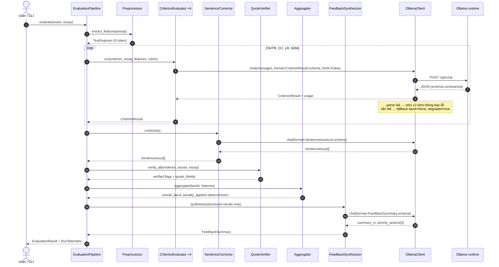
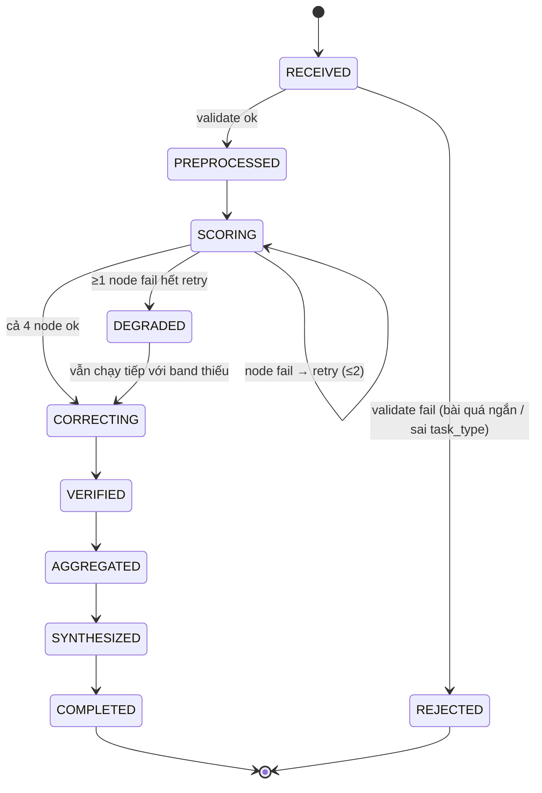

# Data Flow — Luồng hệ thống

---

## 1. Luồng nghiệp vụ end-to-end (P0, CLI)

```text
 [1] INPUT
     exam_id hoặc (exam_prompt + essay + task_type)
             │
             ▼
 [2] VALIDATE                                            ── code, 0 token
     · task_type ∈ {task1, task2}
     · essay không rỗng, ≥ 20 từ (dưới ngưỡng → reject, không phí LLM call)
     · language check thô (tỉ lệ ký tự ASCII)
             │
             ▼
 [3] PREPROCESS  →  TextFeatures                         ── code, 0 token
     word_count · sentence_count · paragraph_count
     type_token_ratio · repeated_content_words[]
     cohesive_devices_found[] · avg_sentence_length
             │
             ├──────────────┬──────────────┬──────────────┐
             ▼              ▼              ▼              ▼
 [4a] TA/TR         [4b] CC         [4c] LR         [4d] GRA     ── 4 LLM call
      evaluator          evaluator       evaluator       evaluator
             │              │              │              │
             └──────────────┴──────┬───────┴──────────────┘
                                   │  4 × CriterionResult
                                   ▼
 [5] SENTENCE CORRECTOR  →  SentenceIssue[]              ── 1 LLM call
                                   │
                                   ▼
 [6] QUOTE VERIFY                                        ── code, 0 token
     mọi evidence.quote phải là substring của essay (đã normalize)
     không khớp → verified=false → lọc khỏi output người dùng
                                   │
                                   ▼
 [7] AGGREGATE                                           ── code, 0 token
     penalty  = f(length_deficit)  →  áp vào band TA/TR (KHÔNG áp vào overall,
                                       tránh phạt hai lần — xem ADR-0003)
     raw      = mean(4 bands sau khi TA/TR đã trừ penalty)
     final    = round_to_half(clamp(raw, 1, 9))
                                   │
                                   ▼
 [8] FEEDBACK SYNTHESIZER  →  summary_vi, priority_actions[3]  ── 1 LLM call
     (nhận structured result, KHÔNG nhận lại essay gốc)
                                   │
                                   ▼
 [9] OUTPUT  EvaluationResult (JSON)  +  RunTelemetry
     → stdout / file / 🔜 DB
```

**Tổng: 6 LLM call/bài.** Ba trong bốn bước tốn kém nhất về độ chính xác (đếm, tính toán, kiểm chứng trích dẫn) **không dùng LLM**.

---

## 2. Sequence diagram



---

## 3. State machine của một lần chấm



**Ghi chú về `DEGRADED`:** một node hỏng **không** làm hỏng cả lần chấm. Kết quả vẫn trả về, có cờ `degraded=true` và tiêu chí lỗi mang `band=null`. Overall band khi đó tính trên các tiêu chí còn lại và **được đánh dấu `partial=true`**, không im lặng giả vờ đầy đủ.

---

## 4. Luồng dữ liệu qua các schema

```text
ExamItem                    TextFeatures
  ├ exam_id                   ├ word_count
  ├ task_type                 ├ sentence_count
  ├ prompt                    ├ paragraph_count
  └ gold (optional)           ├ type_token_ratio
        │                     ├ repeated_content_words[]
        │                     └ cohesive_devices_found[]
        │                           │
        └──────────┬────────────────┘
                   ▼
          CriterionResult × 4
            ├ criterion            (TA|TR|CC|LR|GRA)
            ├ justification        ← sinh TRƯỚC band (bắt buộc)
            ├ band                 (1.0–9.0, bước 0.5)
            ├ confidence           (0–1)
            ├ evidence[]           { quote, comment, polarity, verified }
            ├ strengths[]
            ├ weaknesses[]
            └ improvements[]
                   │
                   ├────────────► SentenceIssue[]
                   │                ├ original / corrected
                   │                ├ error_types[]
                   │                ├ impact
                   │                └ explanation_vi
                   ▼
          EvaluationResult
            ├ overall_band          ← code tính
            ├ raw_overall
            ├ length_penalty
            ├ criteria{}
            ├ sentence_issues[]
            ├ feedback: FeedbackSummary { summary_vi, priority_actions[3], next_band_gap }
            ├ features
            └ telemetry: RunTelemetry
```

---

## 5. Luồng đánh giá (evaluation harness)

```text
data/exams/**/*.json  (10 bài, mỗi bài có gold band 4 tiêu chí)
        │
        ▼
 for each exam × each pipeline_variant:
        run EvaluationPipeline  ──►  EvaluationResult
        │
        ▼
 metrics.compare(predicted, gold)
        ├ MAE_overall, MAE per criterion
        ├ within_0.5 / within_1.0
        ├ bias (sai số có dấu)
        ├ Spearman ρ
        └ system: json_parse_rate · quote_fidelity · latency p50/p95 · tokens
        │
        ▼
 data/reports/{run_id}/
        ├ raw_results.json      (đầy đủ, để audit)
        ├ metrics.json          (để so sánh giữa các version)
        └ report.md             (để đọc)
```

**Điểm cốt lõi:** `metrics.json` là hợp đồng để so sánh phiên bản. Mọi thay đổi prompt/model/pipeline đều phải chạy lại harness trên **cùng dataset** và so `metrics.json` cũ–mới. Không có "cảm giác prompt này tốt hơn".

---

## 6. Xử lý lỗi theo tầng

| Tầng | Lỗi | Xử lý |
| --- | --- | --- |
| Input | Bài < 20 từ | Reject ngay, không gọi LLM |
| Ollama | Connection refused | Fail-fast kèm thông báo "chạy `ollama serve`" |
| Ollama | Model chưa pull | Fail-fast kèm lệnh `ollama pull qwen3.5:4b` |
| Ollama | Cold load 110s | `keep_alive` + warm-up call lúc khởi động |
| LLM output | JSON không parse được | Retry ≤2, lần retry đính kèm thông báo lỗi validation cụ thể |
| LLM output | Band ngoài [1,9] hoặc không bội 0.5 | Clamp + snap về bội 0.5, ghi cờ `coerced` |
| LLM output | Quote không có trong bài | `verified=false`, lọc khỏi feedback, đếm vào metric |
| Node | Fail hết retry | `band=None`, pipeline chuyển `DEGRADED`, vẫn trả kết quả |
